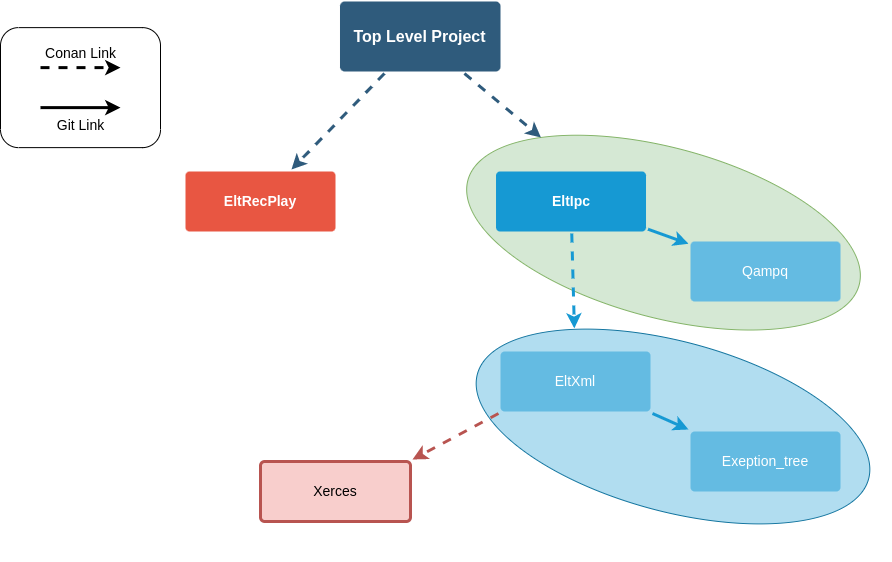

# Fase 0, setup

Prima di iniziare il lavoro è opportuno avere i tools della propria macchina impostati correttamente, per così procedere speditamente.

1. Essendo un porting, è sicuramente necessario installare l'ulteriore versione di Qt, fare riferimento alla [Guida sulle installazi multiple di Qt contenuta qui](..00_utility/elt-system-tool-setup.md) per avere un ambiente che vi permetta facilmente di switchare avanti e indietro.

2. Passando a usare Conan, impostate conan con i setting e le impostazioni contenute nella [guida di installazione di conan](../conan/conan_installazione.md), prestando <mark>particolare attenzione</mark> a rispettare le variabili di ambiente `CONAN_LOGIN_USERNAME` e `CONAN_PASSWORD`, che vengono riusate anche dentro i Cmake e dati per scontato definiti così.

3. **Installare/aggiornare** Cmake almeno alla versione 3.20.MAX, dentro i docker sono impostate le versioni 3.21.4 (ad oggi), quindi se nel processo di porting si dovesse usare una funzione raggiungibile con 3.21.4, non dovrebbero esseci particolari problemi.

## Ristrutturazione dei progetti

Per portare alla nuova gestione i progetti, sono state prese delle scelte e delle direzioni che permettono di semplificare e risolvere sistematicamente le problematiche, è importante quindi tenere a mente le seguenti regole a cui i progetti sottoposti al porting **devono** essere il più allineati possibile, per permettere il funzionamento del tutto.

#### Risoluzione dipendenze: Principio di hiding

L'obiettivo è progettare l'albero dei legami affinchè ogni progetto (Nodo del grafo) è responsabile di conoscere solo i requisiti di se stesso, ed ereditare in automatico (**senza** lavoro esplicito del programmatore quindi) le sotto-dipendenze dai sotto-moduli (Divide-et-Impera).

Si è scelto di utilizzare il sistema di risoluzione per le dipendenze (i.e. `.so` / `.a`) di `conan`. Tuttavia ci si impegna ad essere indipendenti dal tool conan.

Essendo questo lavoro di porting di tipo <u>bottom-up</u>, abbiamo la possibilità di partire dalle foglie e risalire verso i progetti finali e riordinare così tutto senza rischi di lasciare situazioni parziali per sotto compatibilità da risolvere.

**Tutte le librerie** dovranno essere risolte attraverso i `requirement di conan`(come binari).

Resta possibile includere un `sotto-modulo git`, se il sotto modulo non ha nessun conanfile (e quindi nessuna dipendenza ad altri binari gestiti con conan).

Questa architettura di progetto permette di far generare a conan il manifesto delle dipendenze correttamente, così da essere usato in seguito per scaricare tutte le dipendenze nascoste dell'albero.

L'obiettivo è ottenere una struttura simile:



Con questa struttura è quindi possibile per `Top Level Project` scoprire attraverso conan la dipendenza da EltXml e Xerces senza che essa venga esplicitata.

I progetti linkati come sottomoduli git invece, diventano un unicum del progetto che li possiede, e non avendo loro nessuna altra dipendenza che conan dovrebbe risolvere, vengono gestiti normalmente attraverso Cmake.

### Eccezione alla regola

Se per qualche motivo <u>MOLTO STRINGENTE</u> il modulo che si vuole linkare deve essere preso attraverso un `sotto-modulo di git` ed esso purtroppo abbia un conanfile con delle dipendenze da scaricare, diventa responsabilità del modulo <u>padre</u> sapere i requisiti del figlio e aggiungerli al proprio conanfile (e nel tempo mantenerli aggiornati).
Sarebbe opportuno cercare di evitare questa strada se possibile.
Volendo farne un esempio, possiamo immaginare che nell'immagine `Qampq` avesse delle altre dipendenze da risolvere con conan, allora il conanfile di `EltIpc` dovrebbe contenerle, poichè da fuori volendo linkare `EltIpc`, si fa riferimento al conan manifest di `EltIpc`.

# Note di porting da qt5 a qt6 (Per repository con paccchetti Singoli)

## Fase 1/3, abbandono Qmake verso Cmake

1. Modificare il `.gitignore` aggiungendo quello contenuto dentro [general-GitIgnore](general-GitIgnore.txt), che contiene già la maggior parte di tutti i fali che si deve ignorare, sia con il vecchio modo di gestire i  progetti, che quello proposto in questa guida.

2. Si parte aggiungendo sotto-modulo `ELT_COMMON_TOOLS` (a breve verrà spostato in `HMI_CORE` quando i codici saranno maturi).
   **Prestare attenzione** ad editare il file `.gitmodules` dopo aver aggiunto il sotto-modulo, mettendo al posto del path assoluto, il path relativo.
   
   ```
   [submodule "EltIpc/ELT_COMMON_SOURCE"]
    path = EltIpc/01_subModule/ELT_COMMON_TOOLS
    url = ../ELT_COMMON_TOOLS.git
   ```
   
   Resta a discrezione del programmatore se dentro una cartella chiamata `01_subModule` in root, dentro una sotto cartella o direttamente in Root, durante il porting in caso spostarla con `git mv`, se però ci sarà bisogno di Linkarla più volte mettere il sotto modulo in alto e raggiungerlo attraverso i link simbolici relativi.

3. Creare il `CMakeLists.txt` della libreria, usando il `*.pro` come modello da cui replicare le funzionalità
   
   1. Leggere prima la [guida cmake](../cmake/README.md) presente dentro questo repository per capire lo spirito obiettivo a cui puntiamo.
   
   2. Usare `ELT_IPC` come paragone di progetto, essendo la prima e probabilmente più allineata, libreria con il nuovo spirito
   
   3. Se presenti dei pacchetti ottenuti con `conan`, guardando la [guida conan+cmake](../cmake/cmake_conan.md), ri-linkarli usando `cmake`, stando attenti a far generare i file di conan dentro la `build directory` (ben documentata sulla guida). 

4. Una volta ottenuto un cmake che si eseguie senza errori provare a compilare il make generato (**Fare il tutto dentro una cartella di build**), raccogliere i file della sola libreria (NON test/esempi/etc...), in un unica cartella, e dare a questa cartella il nome della libreria che ci si aspettava prima (questo per permettere al `cmake` di usare il nome della directory come nome della libreria).

5. Effettuare il porting degli [eseguibili](../cmake/cmake_bestPractice.md) e dei [test](../cmake/cmake_qt.md).

6. Crea un `cmake` di libreria totale, al top-level, che permetta di compilare tutto (come impostazione di default), ma aggiunga delle impostazioni per disattivare gli esempi e i test (vedi `Elt_IPC`).

7. Risolti i problemi di compilazione locale, modifica il `conanfile.py`, <mark>posizionato dentro la cartella della libreria</mark> (che per ora è usato solo per recuperare le dipendenze), affinchè possa anche  generare ed esportare il pacchetto. 
   
   1. Usa come modello, per standardizzare il lavoro, quello presente nella guida o in `ELT_IPC`.
   
   2. Nei pacchetti, avendo spostato le cartelle, dovrai aggiungere i path ai sorgenti per la copia, <u>RICORDA</u>: il file deve essere eseguito dalla root del repository (come farebbe il docker)
   
   3. Esegui dalla root del repository il `conan create <libFolder/conanfile.py>` e correggi i dettagli finchè non ha successo, a questo punto portati con il terminale dove salva i pacchetti e verifica la presenza delle cartelle `include` e  `lib`, con all'interno tutti e soli i file di nostro interesse.

8. **<u>Elimina i file `.pri`, `.pro` e gli script per creare i pacchetti usati prima di conan</u>**.

9. Allineare e testare il file `.gitlab-ci.yml` affinchè ottenga dei pacchetti come prima, svolgendo ora questa fase, al termine della fase 2 bisognerà al più risolvere problemi di pacchetti sulla macchina docker, ma la struttura non dovrebbe cambiare

A questo punto la libreria hai superato la fase 1, puoi committare e pushare intanto questo risultato rendendo già la libreria utilizzabile.

### Note per repository aggregatori

In repository come `HMI_CORE` in cui saranno contenuti più ricette conan, una in ogni cartella, e che tra loro sono completamente disaccoppiate

## Fase 2/3, Porting da Qt5 a Qt5/6 ibrido

Usando le proprie capacità, impostare come versione di Qt, la Qt6, e iniziare a buildare e correggere finchè non si riesce a ottenere una build di successo per la libreria.

Passare quindi agli esempi e ai test per avere la verifica che tutto funzioni come deve, magari usando a paragone la versione Qt5 terminata in fase 1, e se ci si accorge che i test non passano (da ambo le parti) cercare di modificarli e portarli avanti poichè, evidentemente sono rimasti indietro.

Usare `clang` per riformattare tutto il codice.

## Fase 3/3 Deploy finale

Se il progetto è una semplice libreria, verificare che venga creato il binario sulla pipeline, anche dopo il termine della fase 2.

Se si tratta di un progetto, analizzare il comportamento di `eltDeploy` e far funzionare il deploy anche con la nuova versione.

# Note di porting da qt5 a qt6 (Per repository con paccchetti Multipli)

In casi come `HMI_CORE` che al suo interno contiene più ricette e moduli indipendenti tra loro, ogni cartella è da considerare un progetto singolo (e si seguie quindi la guida sopra), dentro il file `.gitlab-ci.yml` bisognerà eseguirei le varie ricette conan una dopo l'altra cambiandosi di cartella.

---

[`GO --> BACK`](README.md)
